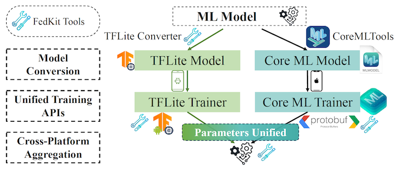
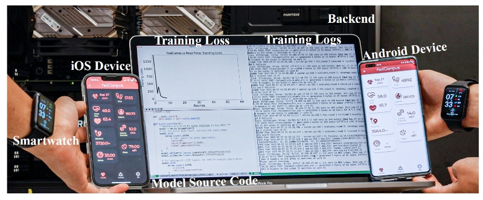
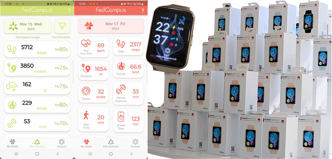

# Education 
**Hong Kong University of Science and Technology** (2023 -)
Doctor of Philosophy (PhD) in Electronic and Computer Engineering
> My superviors: [Prof. Bing Luo (DKU)](https://luobing1008.github.io/) and [Prof. Xuanyu Cao (HKUST)](https://ece.hkust.edu.hk/eexcao)

**The Chinese University of Hong Kong, Shenzhen** (2019 — 2023)
Bachelor of Engineering in Electrical and Computer Engineer, Stream: *Computer Engineering*

----

# Publications
<ol>
<li><b>Shao, J.</b>,Yuan, T., <a href="https://tlin-taolin.github.io/">Lin, T.</a>, <a href="https://ece.hkust.edu.hk/eexcao">Cao, X.</a>, and <a href="https://luobing1008.github.io/">Luo, B.</a>, Cognitive Insights and Stable Coalition Matching for Fostering Multi-Agent Cooperation, <i>arXiv e-prints</i>, arXiv:2405.18044.</li>
<li><b>Shao, J.</b>, <a href="https://tlin-taolin.github.io/">Lin, T.</a>, <a href="https://ece.hkust.edu.hk/eexcao">Cao, X.</a>, and <a href="https://luobing1008.github.io/">Luo, B.</a>, “Federated Unlearning: a Perspective of Stability and Fairness”, <i>arXiv e-prints</i>, 2024. doi:10.48550/arXiv.2402.01276.</li>
<li><b>Shao, J.</b>, Han, S., <a href="https://chaoyanghe.com/">He, C.</a>, and <a href="https://luobing1008.github.io/">Luo, B.</a>, "Privacy-Preserving Federated Heavy Hitter Analytics for Non-IID Data", in Workshop on Federated Learning and Analytics in Practice: Algorithms, Systems, Applications, and Opportunities, in Conjunction with ICML 2023 (FL-ICML' 23), Jul. 2023.</li>
</ol>

-----

# Projects
## FedKit: Enabling Cross-Platform Federated Learning for Android and iOS
* We present FEDKIT, which pipelines Cross-Platform FL for Android and iOS development by enabling model conversion, hardware-accelerated training, and cross-platform model aggregation. 
* Our workflow supports flexible federated learning operations (FLOps) in production, facilitating continuous model delivery and training.
* This is a collaborative project with my supervisor Prof. Luo, DKU undergraduate students Sichang He (lead), Beilong Tang, and Boyan Zhang, as well as collaborators [Xiaomin Ouyang (UCLA)](https://xmouyang.github.io/) and [Daniel Nata (Flower)](linkedin.com/in/daniel-nugraha).
* Our work has been ACCEPTED at IEEE INFOCOM 2024 Demo 🎉.

|  |  |
|:---:|:---:|
| *FedKit Pipeline Overview* | *FedKit Simulation* | 

## FedCampus: A Privacy-Preserving Data Platform for Smart Campus
* We're excited to announce the launch of the **FedCampus** Project - a privacy-preserving smart campus application, available on Android and iOS. 🎉 <a href="https://www.bilibili.com/video/BV1da4y197ne/">Video online available</a>.
* This app implements two key privacy-preserving technologies: Federated Learning and Differential Privacy. Check out our 100 customized smart watches for participants at DKU and FedCampus APP.
* This is a collaborative project with my supervisor Prof. Luo and DKU undergraduate students.

|| <iframe src="https://player.bilibili.com/player.html?aid=664682090&bvid=BV1da4y197ne&cid=1367652871&p=1" scrolling="no" border="0" frameborder="no" framespacing="0" allowfullscreen="true" height="200"> </iframe>|
|:---:|:---:|
|  | | 

## Edge-based Cross-device Federated Learning Prototypes
* Our prototype supports Mobile and IoT devices operating at WiFi and USRP-based 4G/5G wireless networks.
* This is a collaborative project with my supervisor Prof. Luo and students from CUHKSZ

---
# Teaching Assistant
* ELEC3120 - Computer Communication Networks (HKUST, Spring 2024)

---

# Patents

- B. Luo, **J. Shao**, Method and Apparatus for Online Parameter Selection in Minimizing the Total Cost of Federated Learning, CN202310485067.8, Apr. 2023, field
- B. Luo, **J. Shao**, Method and Apparatus for Online Client Sampling in Minimizing the Training time of Federated Learning, CN 202310484383.3, Apr. 2023, field
- B. Luo, **J. Shao**, J. Huang, Method and Apparatus for Frequent Items Mining Using Federated Analytics, CN202310365167.7, Mar. 2023, field
- B. Luo, **J. Shao**, J. Huang, Method and Apparatus for Frequent Data Mining Based on Hierarchical Federated Analytics, CN202310330791.3, Mar. 2023, field