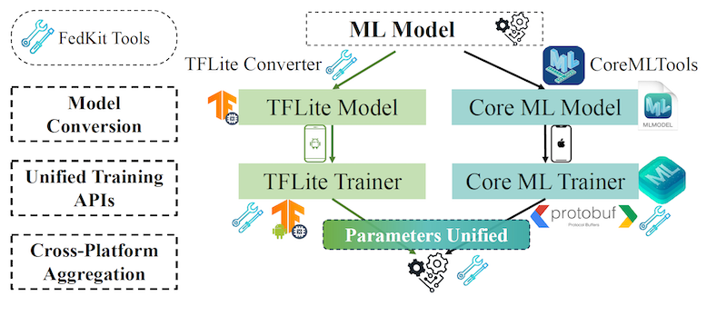
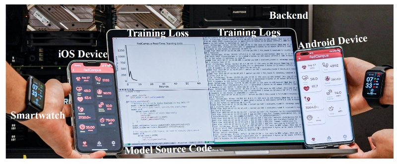
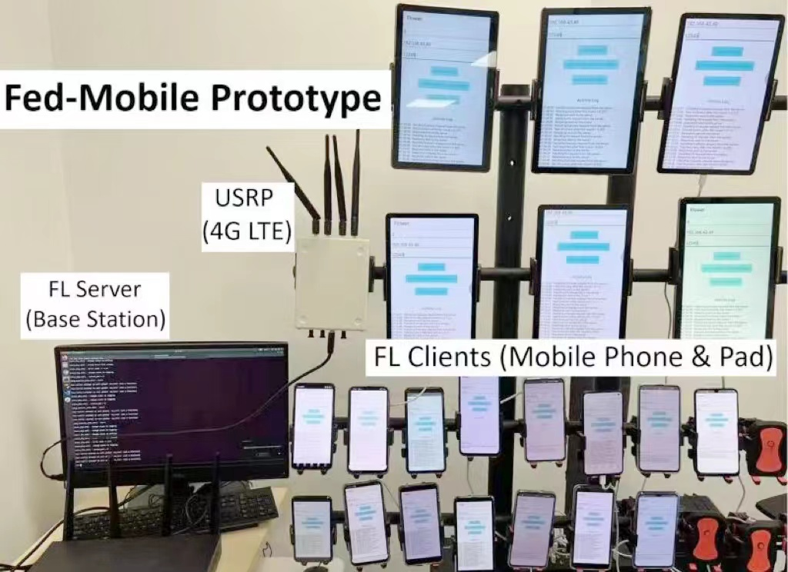
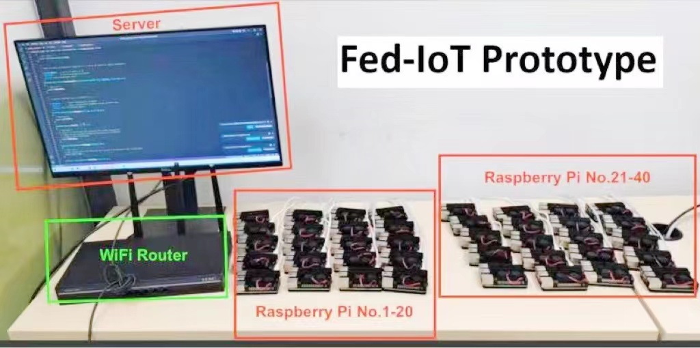

> PhD, HKUST · Expected Graduation: June 2027 · Target: LLM Agent / RL / Agent Systems
>
> I build agents that reason, search, and collaborate across long horizons. Currently at **Tencent Hunyuan** researching agent harness and evaluation infrastructure. Previously at **ByteDance** building daemonized long-running agent systems.

----

# Education 

**Hong Kong University of Science and Technology** (2023 Fall – )
Doctor of Philosophy (PhD) in Electronic and Computer Engineering
> Supervisor: [Prof. Wei Zhang (HKUST)](https://seng.hkust.edu.hk/about/people/faculty/wei-zhang) · Long-term collaborator: [Prof. Bing Luo (DKU)](https://luobing1008.github.io/)

**The Chinese University of Hong Kong, Shenzhen** (2019 — 2023)
Bachelor of Engineering in Electrical and Computer Engineering, *Computer Engineering Stream*

----

# Experience

## Tencent | Senior Researcher (Hunyuan LLM Team, Qingyun Internship Program)
*May 2026 – Present*

* Research on **agent4research harness** — scalable evaluation and execution infrastructure for LLM-driven research agents.
* Research on **harness eval** — rigorous evaluation methodologies and benchmarks for long-horizon agent capabilities.
* Research on **RSI (recursive self-improvement) evaluation** — systematic evaluation framework for self-improving LLM research agents.

## ByteDance | Intern (Agent Long-Horizon Self-Iterative Algorithm Systems)
*Jan. 2026 – May 2026*

* Led end-to-end implementation of a long-running agent and self-iterative algorithm project.
* Designed **Daemon + Rubric + Harness** architecture for daemonized scheduling, rubric-driven evaluation/iteration, and harness-based orchestration.
* Enabled **Auto / Interactive / Human-Interrupt** modes for autonomous execution and manual takeover.
* Built robust state management with stage transitions, failure recovery, and human handoff.

----

# Research Focus

LLM Agents Agentic RL Multi-Agent Systems Evaluation

My research centers on **long-horizon LLM agents** across three directions:

1. **Agentic RL algorithms** — stabilizing multi-turn optimization under non-stationary context (FoldAct)
2. **Evaluation methodology** — moving beyond end-task accuracy to measure how agents gather, revise, and calibrate evidence in the loop (SeekBench, ICLR 2026)
3. **Agent systems** — harness infrastructure for sustained autonomous execution and rigorous evaluation at production scale (ByteDance, Tencent Hunyuan)

----

# Representative Research

## SeekBench: Benchmarking Epistemic Competence in LLM Search Agents
ICLR 2026 First Author Benchmark & Evaluation

* Developed a standardized benchmark evaluating LLM search agents beyond end-task accuracy — measuring **how** agents search, not just **whether** they succeed.
* Introduced trajectory-level metrics: **Groundedness**, **Recovery**, and **Calibration**.
* [GitHub](https://github.com/SHAO-Jiaqi757/SeekBench) · [arXiv](https://arxiv.org/abs/2509.22391)

## HackDetect: Protocol Validity and Reward-Hacking Audit for Agent Benchmarks
arXiv 2026 First Author Benchmark Audit

* Formulated **protocol validity** for agent benchmarks and developed a post-hoc audit framework to identify reward-hacking exposures.
* Audited 2,385 traces across 15 agent benchmarks; found evidence of exposures in **67% of Frontier Science** and **66.7% of AutoLab** traces.
* Measured score inflation of **0.45–1.00** across paired comparisons, showing benchmark reports must provide evidence that scores reflect intended capabilities.
* [arXiv](https://arxiv.org/abs/2607.22368)

## When Stored Evidence Stops Being Usable: Scale-Conditioned Evaluation of Agent Memory
arXiv 2026 Co-first Author Evaluation Protocol

* Presented a scale-conditioned evaluation protocol for agent memory under evidence-preserving growth: task evidence fixed, irrelevant sessions added.
* Reported four trajectory-level diagnostics: budget-compliant reliability, tail memory-call burden, failure-regime decomposition, and usable-scale boundary.
* Showed that reliability loss is not a single phenomenon — similar drops can hide entirely different failure regimes across memory interfaces.
* [arXiv](https://arxiv.org/abs/2605.07313)

## FoldAct: Efficient and Stable Context Folding for Long-Horizon Search Agents
arXiv 2025 First Author Algorithm

* Proposed a context-folding algorithm for long-horizon LLM agents under multi-turn RL.
* Achieved up to **5.19× training speedup** while maintaining strong long-horizon decision quality.
* [GitHub](https://github.com/SHAO-Jiaqi757/FoldAct)

## MorphAgent: Self-Evolving Multi-Agent Collaboration Platform
ICML-MAS 2025 Co-first Author Multi-Agent System

* Designed a decentralized collaboration framework where LLM agents dynamically evolve roles without predefined structures.
* Demonstrated improved task performance, transferability, and robustness across reasoning and coding benchmarks.

## Beyond Right to be Forgotten: Managing Heterogeneity Side Effects Through Strategic Incentives
ACM MobiHoc 2025 First Author Federated Learning

* Studied heterogeneity side effects in federated unlearning under non-IID data.
* Developed a Stackelberg-game-based incentive mechanism to retain crucial clients and improve stability.

----

# Publications

### 2026
<ol class="pub-list">
<li><b>Shao, J.</b>, Lin, Y., Lohani, M. P., Miao, Y., and <a href="https://luobing1008.github.io/">Luo, B.</a>, "Do LLM Agents Know How to Ground, Recover, and Assess? A Benchmark for Epistemic Competence in Information-Seeking Agents", <i>ICLR 2026</i>. 🎉 <a href="https://arxiv.org/abs/2509.22391">[arXiv]</a> <a href="https://github.com/SHAO-Jiaqi757/SeekBench">[Code]</a></li>
<li><b>Shao, J.</b>, "HackDetect: Protocol Validity and Reward-Hacking Audit for Agent Benchmarks", <i>arXiv e-prints</i>, arXiv:2607.22368, 2026. <a href="https://arxiv.org/abs/2607.22368">[arXiv]</a></li>
<li><b>Shao, J.</b>, Lu, Y., Zhang, Y., and <a href="https://luobing1008.github.io/">Luo, B.</a>, "When Stored Evidence Stops Being Usable: Scale-Conditioned Evaluation of Agent Memory", <i>arXiv e-prints</i>, arXiv:2605.07313, 2026. (*Equal contribution with Y. Lu) <a href="https://arxiv.org/abs/2605.07313">[arXiv]</a></li>
</ol>

### 2025
<ol class="pub-list" start="4">
<li><b>Shao, J.</b>, <a href="https://tlin-taolin.github.io/">Lin, T.</a>, <a href="https://xiaojin319.github.io/">Zhang, X.</a>, <a href="https://seng.hkust.edu.hk/about/people/faculty/qiang-yang">Yang, Q.</a>, and <a href="https://luobing1008.github.io/">Luo, B.</a>, "Beyond Right to be Forgotten: Managing Heterogeneity Side Effects Through Strategic Incentives", <i>ACM MobiHoc 2025</i>. 🎉</li>
<li>Lu, S.*, <b>Shao, J.*</b>, <a href="https://luobing1008.github.io/">Luo, B.</a>, and <a href="https://tlin-taolin.github.io/">Lin, T.</a>, "MorphAgent: Empowering Agents Through Self-Evolving Profiles and Decentralized Collaboration", <i>ICML-MAS 2025</i>. (*Equal contribution)</li>
<li><b>Shao, J.</b>, Yuan, T., <a href="https://tlin-taolin.github.io/">Lin, T.</a>, and <a href="https://luobing1008.github.io/">Luo, B.</a>, "Cognitive Insights and Stable Coalition Matching for Fostering Multi-Agent Cooperation", <i>arXiv e-prints</i>, arXiv:2405.18044.</li>
<li>Fan, T., Gu, H., Cao, X., Chan, C. S., Chen, Q., Chen, Y., Feng, Y., Gu, Y., Geng, J., Luo, B., Liu, S., Ong, W. K., Ren, C., <b>Shao, J.</b>, Sun, C., Tang, X., Tae, H. X., Tong, Y., Wei, S., Wu, F., Xi, W., Xu, M., Yang, H., Yang, X., Yan, J., Yu, H., Yu, H., Zhang, T., Zhang, Y., Zhang, X., Zheng, Z., Fan, L., and Yang, Q., "Ten Challenging Problems in Federated Foundation Models", <i>IEEE TKDE</i>, 2025.</li>
</ol>

### 2024
<ol class="pub-list" start="9">
<li>He, S., Tang, B., Zhang, B., <b>Shao, J.</b>, <a href="https://xmouyang.github.io/">Ouyang, X.</a>, Nugraha, D. N., and <a href="https://luobing1008.github.io/">Luo, B.</a>, "FedKit: Enabling Cross-Platform Federated Learning for Android and iOS", <i>IEEE INFOCOM WKSHPS</i>, 2024.</li>
<li>Geng, J., Tang, B., Zhang, B., <b>Shao, J.</b>, and <a href="https://luobing1008.github.io/">Luo, B.</a>, "FedCampus: A Real-world Privacy-preserving Mobile Application for Smart Campus via Federated Learning & Analytics", <i>ACM MobiHoc (Demo)</i>, 2024.</li>
</ol>

### 2023
<ol class="pub-list" start="11">
<li><b>Shao, J.</b>, Han, S., <a href="https://chaoyanghe.com/">He, C.</a>, and <a href="https://luobing1008.github.io/">Luo, B.</a>, "Privacy-Preserving Federated Heavy Hitter Analytics for Non-IID Data", <i>FL-ICML Workshop</i>, 2023.</li>
</ol>

----

# Projects

## MASArena: Benchmarking Framework for Multi-Agent Systems
Open Source System

* Led design and implementation of a modular benchmarking framework for single- and multi-agent systems, co-developed by DKU-Edge Intelligence Lab and Westlake University LINs-Lab.
* Architected plug-and-play modules, built-in benchmarks, visual debugging, and seamless agent/tool/dataset integration.
* [GitHub →](https://github.com/LINs-lab/MASArena)

## FedKit: Cross-Platform Federated Learning for Mobile
Mobile Federated Learning

* Pipelined cross-platform FL for Android and iOS with model conversion, hardware-accelerated training, and cross-platform aggregation.
* Accepted at **IEEE INFOCOM 2024 Demo** 🎉.

|  |  |
|:---:|:---:|
| *FedKit Pipeline Overview* | *FedKit Simulation* |

## FedCampus: Privacy-Preserving Smart Campus Platform
Mobile App Differential Privacy

* Privacy-preserving smart campus application on Android and iOS, implementing Federated Learning and Differential Privacy.
* 100+ customized smart watches deployed at DKU.
* [Video →](https://www.bilibili.com/video/BV1da4y197ne/)

|| <iframe src="https://player.bilibili.com/player.html?aid=664682090&bvid=BV1da4y197ne&cid=1367652871&p=1" scrolling="no" border="0" frameborder="no" framespacing="0" allowfullscreen="true" allow="autoplay 'none'; fullscreen" height="200"> </iframe>|
|:---:|:---:|

## Edge-based Cross-device Federated Learning Prototypes
IoT Edge Computing

* Prototype supporting Mobile and IoT devices over WiFi and USRP-based 4G/5G wireless networks.

----

# Talks & Invited Seminars

* **Vibe Coding Seminar**, Duke Kunshan University (DKU), April 2025

----

# Teaching Assistant

* ELEC3120: Computer Communication Networks (HKUST, Spring 2024)
* ELEC3300: Introduction to Embedded Systems (HKUST, Fall 2024)
* ECE 586K: Vector Space Methods with Applications (DKU, Spring 2025)
* ECE 590K: Advanced Topics in Electrical and Computer Engineering (DKU)

----

# Patents

- B. Luo, **J. Shao**, "Method and Apparatus for Online Parameter Selection in Minimizing the Total Cost of Federated Learning", CN202310485067.8, Apr. 2023
- B. Luo, **J. Shao**, "Method and Apparatus for Online Client Sampling in Minimizing the Training Time of Federated Learning", CN202310484383.3, Apr. 2023
- B. Luo, **J. Shao**, J. Huang, "Method and Apparatus for Frequent Items Mining Using Federated Analytics", CN202310365167.7, Mar. 2023
- B. Luo, **J. Shao**, J. Huang, "Method and Apparatus for Frequent Data Mining Based on Hierarchical Federated Analytics", CN202310330791.3, Mar. 2023
